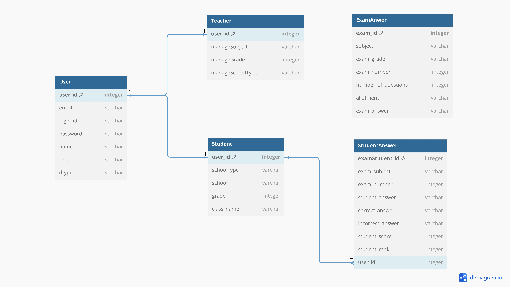

# AMS
 학원 성적 관리 시스템

 

## ERD

   
  
   

 

## 기술 스택
### Front-end
|  React  |  TailWind  | JavaScript |  Node JS |  Chart.JS  |
| :-----: | :---------:| :--------: | :------: | :--------: |
| ![react]| ![tailwind]|   ![js]    | ![nodejs]| ![chartjs] |

### Back-end
|   Java   |   Spring  |  SpringBoot |  JPA  | Spring Data JPA |  MariaDB  |
| :------: | :-------: | :---------: | :---: |  :------------: | :-------: |
|  ![java] | ![spring] |    ![sb]    | ![jpa]|     ![sdj]      |   ![mdb]  |

 

## 구현 기능

<b>학생 페이지</b>

### 학생 메인 페이지
과목별(영어 & 수학) 회차별 시험에 대한 다양한 정보를 제공하는 페이지입니다. 페이지에서 제공하는 차트별 기능은 다음과 같습니다.

#### 1. 명예의 전당
- 해당 회차에서 가장 높은 점수를 받은 학생의 명단을 나타내는 기능으로 학생의 이름과 순위, 점수를 제공하는 차트입니다.

#### 2. 오답률 순위
- 해당 회차에서 가장 높은 오답률을 나타내는 문항의 정보를 나타내는 기능으로 해당 문항의 번호와 오답률, 정답, 해당 문항의 번호별 선택 비율을 제공하는 차트입니다.

#### 3. 개인 성적표
- 해당 회차에서 로그인한 학생의 성적표(점수, 등수)와 오답표(문항별 정답, 학생이 선택한 답, 해당 문항의 전체 오답률)를 제공하는 기능입니다.

#### 4. 성적 그래프
- 학생이 치룬 모든 시험의 회차별 정보(점수, 등수)를 그래프로 제공하여 자신의 성적 변화 추이를 확인할 수 있는 기능입니다.

#### 5.개인 성적 순위
- 학생이 치룬 모든 시험 중에서 가장 높은 점수를 받은 시험의 회차 정보(점수, 등수)를 제공하는 기능입니다.

### 학생 정답 입력 페이지
- 학생이 시험을 치룬 회차의 정답을 번호별로 입력하는 기능을 제공합니다.

 

<b>선생 페이지</b>

  

  
### 선생 메인 페이지
- 과목별(영어 & 수학) 회차별 시험에 대한 다양한 정보를 제공하는 페이지입니다. 페이지에서 제공하는 차트별 기능은 다음과 같습니다.

#### 1. 명예의 전당
- 해당 회차에서 가장 높은 점수를 받은 학생의 명단을 나타내는 기능으로 학생의 이름과 순위, 점수를 제공하는 차트입니다.

#### 2. 오답률 순위
- 해당 회차에서 가장 높은 오답률을 나타내는 문항의 정보를 나타내는 기능으로 해당 문항의 번호와 오답률, 정답, 해당 문항의 번호별 선택 비율을 제공하는 차트입니다.

#### 3. 성적 그래프
- 해당 회차 시험을 치룬 학생들의 이름과 점수를 막대 그래프로 제공하는 기능입니다.

#### 4. 성적 정규 분포
- 해당 회차 시험에서 점수별 학생들의 수를 제공하는 기능으로 학생들의 점수가 어떻게 분포되어 있는지를 확인할 수 있습니다.

#### 5.평균 점수
- 회차별로 학생들의 평균 점수를 제공하는 기능입니다. 회차별 평균 점수를 그래프로 제공하여 회차별 평균 비교와 변화 추이를 한눈에 파악할 수 있습니다.

### 선생 정답 입력 페이지
- 시험을 치룬 회차의 정답표를 만드는 페이지로 문항별 정답과 배점을 입력하고 저장할 수 있는 기능을 제공합니다. 또한 아래 채점하기 기능을 제공하며 해당 회차의 채점이 완료되지 않은 학생 수를 제공하여 채점 현황을 파악할 수 있는 기능을 제공합니다.

### 선생 정답 수정 페이지
- 이미 정답표가 존재하는 회차의 정답표를 수정할 수 있는 페이지로 문항별 정답과 배점을 입력하여 정답표를 수정할 수 있는 기능을 제공합니다.

 

[react]: /image/icons/react.svg
[tailwind]: /image/icons/tailWindCSS.png
[js]: /image/icons/javascript.svg
[nodejs]: /image/icons/nodejs.png
[chartjs]: /image/icons/chartjs.svg

[java]: /image/icons/java.png
[spring]: /image/icons/spring.png
[sb]: /image/icons/springboot.png
[jpa]: /image/icons/jpa.png
[sdj]: /image/icons/springdatajpa.png
[mdb]: /image/icons/mariadb.png

